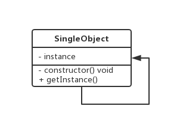

# 单例模式

- 单例模式可能是设计模式里面最简单的模式了，虽然简单，但在我们日常生活和编程中却经常接触到，本节我们一起来学习一下。
- 单例模式 （Singleton Pattern）又称为单体模式，保证一个类只有一个实例，并提供一个访问它的全局访问点。也就是说，第二次使用同一个类创建新对象的时候，应该得到与第一次创建的对象完全相同的对象。

## **1. 你曾经遇见过的单例模式**

- 当我们在电脑上玩经营类的游戏，经过一番眼花缭乱的骚操作好不容易走上正轨，夜深了我们去休息，第二天打开电脑，发现要从头玩，立马就把电脑扔窗外了，所以一般希望从前一天的进度接着打，这里就用到了存档。每次玩这游戏的时候，我们都希望拿到同一个存档接着玩，这就是属于单例模式的一个实例。
- 编程中也有很多对象我们只需要唯一一个，比如数据库连接、线程池、配置文件缓存、浏览器中的 window/document 等，如果创建多个实例，会带来资源耗费严重，或访问行为不一致等情况。
- 类似于数据库连接实例，我们可能频繁使用，但是创建它所需要的开销又比较大，这时只使用一个数据库连接就可以节约很多开销。一些文件的读取场景也类似，如果文件比较大，那么文件读取就是一个比较重的操作。比如这个文件是一个配置文件，那么完全可以将读取到的文件内容缓存一份，每次来读取的时候访问缓存即可，这样也可以达到节约开销的目的。

**在类似场景中，这些例子有以下特点：**

- 每次访问者来访问，返回的都是同一个实例；
- 如果一开始实例没有创建，那么这个特定类需要自行创建这个实例；

## **2. 实例的代码实现**

**类图**



### **2.1 代码实现**

我们可以使用 JavaScript 来将浏览器的 Window 单例实现一下。

> 首先是 ES6 方式：

```ts
class Window {
  // 存储单例
  // private修饰符保证在类外面不能访问
  private static instance: Window

  // 静态方法保证通过类名能直接访问到该方法，不用new
  public static getInstance() {
    // 判断是否已经有单例了
    if (!Window.instance) {
      Window.instance = new Window()
    }
    //返回实例
    return Window.instance
  }
}
//把Window做成单例
let w1 = Window.getInstance()
let w2 = Window.getInstance()
console.log(w1 === w2) //true
```

> ES5 方式同理

```js
function Window() {}
Window.prototype.hello = function () {
  console.log("hello")
}

// 立即执行函数；属性方法，不是原型方法，不用new
Window.getInstance = (function () {
  // 上层作用域缓存单例实例
  let window: Window
   // 闭包访问外部作用域中的实例变量
  return function () {
    // 判断是否已经有单例了
    if (!window) {
      window = new (Window as any)()
    }
    return window
  }
})()
// 缺点：必须要告诉使用者通过getInstance方法得到单例
let w1 = Window.getInstance()
let w2 = Window.getInstance()
console.log(w1 === w2) //true
```

### **2.2 初步优化——透明单例**

上面的实现没有问题，也可以正常运行，但是这种使用方式有缺点，就是说必须要告诉使用者通过`getInstance`方法得到单例

**特点**

- 客户端或者说使用者并不需要知道要按单例使用

```js
let Window = (function () {
  let window
  let WindowInstance = function () {
    if (window) {
      return window
    } else {
      //如果说构造函数返回一个对象的话,this就是创建的对象
      return (window = this)
    }
  }
  return WindowInstance
})()
let w1 = new Window()
let w2 = new Window()
console.log(w1 === w2) //ture
```

### **2.3 单例与构建过程的分离**

```ts
interface Window {
  hello: any
}
function Window() {}
Window.prototype.hello = function () {
  console.log("hello")
}
//专门用来创建Window单例
let createInstance = (function () {
  let instance: Window
  return function () {
    if (!instance) {
      instance = new (Window as any)()
    }
    return instance
  }
})()

let window1 = createInstance()
let window2 = createInstance()
window1.hello()
console.log(window1 === window2)
```

### **2.4 封装变化**

上述`2.3`的代码中的`createInstance`只是用能创建 Window 实例，我们希望这个`createInstance`可以创建任何类型的实例

```ts
interface Window {
  hello: any
}
function Window() {}
Window.prototype.hello = function () {
  console.log("hello")
}
//希望这个createInstance可以创建任何类型的实例
let createInstance = function (Constructor: any) {
  let instance: any
  return function AnyConstructor(this: any) {
    if (!instance) {
      //正常来说 this.__proto__=AnyConstructor.prototype
      Constructor.apply(this, arguments)
      //this.__proto__= Constructor.prototype
      Object.setPrototypeOf(this, Constructor.prototype)
      instance = this
    }
    return instance
  }
}
let createWindow = createInstance(Window)
let w1 = new (createWindow as any)()
let w2 = new (createWindow as any)()
console.log(w1 === w2) //true
```

### **2.5 惰性单例、懒汉式-饿汉式**

- 有时候一个实例化过程比较耗费性能的类，但是却一直用不到，如果一开始就对这个类进行实例化就显得有些浪费，那么这时我们就可以使用惰性创建，即延迟创建该类的单例。之前的例子都属于惰性单例，实例的创建都是 `new` 的时候才进行。

**惰性单例又被成为懒汉式，相对应的概念是饿汉式：**

- 懒汉式单例是在使用时才实例化
- 饿汉式是当程序启动时或单例模式类一加载的时候就被创建。
- 我们可以举一个简单的例子比较一下：

> 饿汉式

```ts
class Window {
  //直接进行创建
  private static instance: Window = new Window()
  public static getInstance() {
    return Window.instance
  }
}
//把Window做成单例
let w1 = Window.getInstance()
let w2 = Window.getInstance()
console.log(w1 === w2)
```

> 懒汉式

```ts
class Window {
  // 存储单例
  private static instance: Window

  public static getInstance() {
    // 判断是否已经有单例了
    if (!Window.instance) {
      Window.instance = new Window()
    }
    //返回实例
    return Window.instance
  }
}
//把Window做成单例
let w1 = Window.getInstance()
let w2 = Window.getInstance()
console.log(w1 === w2) //true
```

惰性创建在实际开发中使用很普遍，了解一下对以后的开发工作很有帮助。

## **3. 单例模式的优缺点**

单例模式主要解决的问题就是节约资源，保持访问一致性。

**简单分析一下它的优点：**

- 单例模式在创建后在内存中只存在一个实例，节约了内存开支和实例化时的性能开支，特别是需要重复使用一个创建开销比较大的类时，比起实例不断地销毁和重新实例化，单例能节约更多资源，比如数据库连接；
- 单例模式可以解决对资源的多重占用，比如写文件操作时，因为只有一个实例，可以避免对一个文件进行同时操作；
- 只使用一个实例，也可以减小垃圾回收机制 `GC（Garbage Collecation）` 的压力，表现在浏览器中就是系统卡顿减少，操作更流畅，CPU 资源占用更少；

**单例模式也是有缺点的**

- 单例模式对扩展不友好，一般不容易扩展，因为单例模式一般自行实例化，没有接口；
- 与单一职责原则冲突，一个类应该只关心内部逻辑，而不关心外面怎么样来实例化；

## **4.单例模式的使用场景**

那我们应该在什么场景下使用单例模式呢：

- 当一个类的实例化过程消耗的资源过多，可以使用单例模式来避免性能浪费；
- 当项目中需要一个公共的状态，那么需要使用单例模式来保证访问一致性；

### **4.1 commonjs模块加载机制**

[HotModuleReplacement](https://github.com/webpack/webpack/blob/8070bcd333cd1d07ce13fe5e91530c80779d51c6/lib/hmr/HotModuleReplacement.runtime.js#L55)

```js
(function(modules) {
  // webpack的启动函数
  //模块的缓存
  var installedModules = {};
  //定义在浏览器中使用的require方法
  function __webpack_require__(moduleId) {
    //检查模块是否在缓存中
    if (installedModules[moduleId]) {
      return installedModules[moduleId].exports;
    }
    //创建一个新的模块并且放到模块的缓存中
    var module = (installedModules[moduleId] = {
      i: moduleId,
      l: false,
      exports: {}
    });

    //执行模块函数
    modules[moduleId].call(
      module.exports,
      module,
      module.exports,
      __webpack_require__
    );

    //把模块设置为已经加载
    module.l = true;

    //返回模块的导出对象
    return module.exports;
  }
}
```

### **4.2 jQuery**

[jquery](https://code.jquery.com/jquery-3.4.1.js)

```js
if(window.jQuery!=null){
  return window.jQuery;
}else{
    //init~~~~~~~
}
```

### **4.3 模态窗口**

[bootstrap modal.js](https://github.com/twbs/bootstrap/blob/main/js/src/modal.js)

```js
<!DOCTYPE html>
<html lang="en">

<head>
    <meta charset="UTF-8">
    <meta name="viewport" content="width=device-width, initial-scale=1.0">
    <meta http-equiv="X-UA-Compatible" content="ie=edge">
    <title>Document</title>
</head>

<body>
    <button id="show-button">显示模态窗口</button>
    <button id="hide-button">隐藏模态窗口</button>
    <script>
        class Login {
            constructor() {
                this.element = document.createElement('div');
                this.element.innerHTML = (
                    `
                      用户名 <input type="text"/>
                      <button>登录</button>
                    `
                );
                this.element.style.cssText = 'width: 100px; height: 100px; position: absolute; left: 50%; top: 50%; display: block;';
                document.body.appendChild(this.element);
            }
            show() {
                this.element.style.display = 'block';
            }
            hide() {
                this.element.style.display = 'none';
            }
        }
        // 模态窗口显示和隐藏没必须每次都重新创建，创建的开销很大
        Login.getInstance = (function () {
            let instance;
            return function () {
                if (!instance) {
                    instance = new Login();
                }
                return instance;
            }
        })();

        document.getElementById('show-button').addEventListener('click', function (event) {
            Login.getInstance().show();
        });
        document.getElementById('hide-button').addEventListener('click', function (event) {
            Login.getInstance().hide();
        });
    </script>
</body>

</html>
```


### **4.3 store状态管理**

[createStore](https://github.com/reduxjs/redux/blob/master/src/createStore.ts)

```js
// redux应用里，只会有一个仓库，他是单例的
// 为了实现组件可以通信，仓库必须是单例的，只有一个
function createStore(reducer: any) {
    let state: any;
    let listeners: any[] = [];
    function getState() {
        return state;
    }
    function dispatch(action: any) {
        state = reducer(state, action);
        listeners.forEach(l => l());
    }
    function subscribe(listener: any) {
        listeners.push(listener);
        return () => {
            listeners = listeners.filter(item => item != listener);
            console.log(listeners);
        }
    }
    dispatch({});
    return {
        getState,
        dispatch,
        subscribe
    }
}
let store = createStore((state: any, action: any) => state);
```

### **4.3 缓存**

```js
let express = require('express');
let fs = require('fs');
let cache: Record<any, any> = {};
let app = express();
app.get('/user/:id', function (req: any, res: any) {
    let id = req.params.id;
    let user = cache.get(id);
    if (user) {
        res.json(user);
    } else {
        fs.readFile(`./users/${id}.json`, 'utf8', function (err: any, data: any) {
            let user = JSON.parse(data);
            cache.put(id, user);
            res.json(user);
        });
    }
});
app.listen(3000);
```

### **4.4 命名空间**

+ 用户编写的代码与内部的类/函数/常量或第三方类/函数/常量之间的名字冲突。
+ 为很长的标识符名称创建一个别名（或简短）的名称，提高源代码的可读性。

 jQuery

 ```js
 let $ = {
  ajax(){},
  get(){},
  post(){}
}
 ```
```js
let utils={};
utils.def=function (namespace,fn) {
    let namespaces=namespace.split('.');
    let fnName=namespaces.pop();
    let current=utils;
    for (let i=0;i<namespaces.length;i++){
        let namespace=namespaces[i];
        if (!current[namespace]) {
            current[namespace]={};
        }
        current=current[namespace];
    }
    current[fnName]=fn;
}
utils.def('dom.attr',function (key) {
    console.log('dom.attr');
});
utils.def('dom.html',function (html) {
    console.log('dom.html');
});
utils.def('string.trim',function () {
    console.log('string.trim');
});
utils.dom.attr('src');
utils.string.trim(' aaa ');
```

### **4.5 LRU缓存 **

[lru-cache](https://leetcode.com/problems/lru-cache/)

为`LRU Cache`设计一个数据结构，它支持两个操作：
+ 1）`get(key)`：如果`key`在`cache`中，则返回对应的`value`值，否则返回-1
+ 2）`set(key,value)`:如果`key`不在`cache`中，则将该`(key,value)`插入`cache`中（注意，如果`cache`已满，则必须把最近最久未使用的元素从`cache`中删除）；如果`key`在`cache`中，则重置`value`的值。

```js
/**
- 用一个数组来存储数据，给每一个数据项标记一个访问时间戳
- 每次插入新数据项的时候，先把数组中存在的数据项的时间戳自增,并将新数据项的时间戳置为0并插入到数组中
- 每次访问数组中的数据项的时候，将被访问的数据项的时间戳置为0。
- 当数组空间已满时，将时间戳最大的数据项淘汰。
*/
class LRUCache{
    constructor(capacity) {
        this.capacity=capacity;
        this.members=[];
    }
    put(key,value) {
        let found=false;
        let oldestIndex=-1;
        let oldestAge=-1;
        for (let i=0;i<this.members.length;i++){
            let member=this.members[i];
            if (member.age > oldestAge) {
                oldestIndex=i;
                oldestAge=member.age;
            }
            if (member.key==key) {
                this.members[i]={key,value,age: 0};
                found=true;
            } else {
                member++;
            }
        }
        if (!found) {
            if (this.members.length>=this.capacity) {
                this.members.splice(oldestIndex,1);
            }
            this.members[this.members.length]={
                key,
                value,
                age:0
            }
        }
    }
    get(key) {
        for (let i=0;i<this.members.length;i++){
            let member=this.members[i];
            if (member.key==key) {
                member.age=0;
                return member.value;
            }
        }    
        return -1;
    }
}

let cache=new LRUCache(3);
cache.put('1',1);
cache.put('2',2);
cache.put('3',3);
console.log(cache.get('1'));
console.log(cache.get('2'));
console.log(cache.get('3'));
cache.put('4',4);
console.log(cache.get('1'));
console.log(cache.get('4'));
console.log(cache);
```

