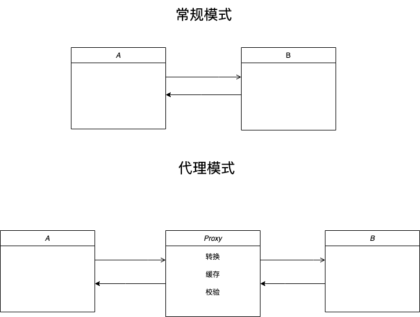

## 代理模式

> 代理模式 （Proxy Pattern）又称委托模式，它为目标对象创造了一个代理对象，以控制对目标对象的访问，也可以理解为对外暴露的接口并不是原对象。通俗地讲，生活中也有比较常见的代理模式：中介、寄卖、经纪人等等。而这种模式存在的意义在于当访问者与被访问者不方便直接访问/接触的情况下，提供一个替身来处理事务流程，实际访问的是替身，替身将事务做了一些处理/过滤之后，再转交给本体对象以减轻本体对象的负担。



## 常见代理模式

  - 保护代理
  - 虚拟代理
  - 缓存代理
  - ES6 Proxy
  - 。。。

## 实现
  保护代理：
  ```js
    /**
    * 保护代理简单实现
    * client向服务端发送一个请求
    * proxy代理请求转发给服务端
    * 服务端处理请求
    */

    // 改进前
    const Request = function () {};
    ​
    const client = {
     requestTo: (server) => {
       const req = new Request();
       server.receiveRequest(req);
      },
    };
    ​
    const server = {
     handleRequest: (request) => {
       console.log('receive request: ', request);
      },
    };
    ​
    const proxy = {
     receiveRequest: (request) => {
       console.log('proxy request: ', request);
       server.handleRequest(request);
      },
    };
    ​
    client.requestTo(proxy);

    // 改进后
    const proxy = {
     receiveRequest: (request) => {
       // 校验身份
       const pass = validatePassport(request);
       if (pass) {
         // 监听服务端 ready 后代理请求
         server.listenReady(() => {
           console.log('proxy request: ', request);
           server.handleRequest(request);
         });
       }
      },
    };
  ```

  虚拟代理：虚拟代理是把一些开销很大的对象或者方法，延迟到真正需要它的时候才去创建执行

  ```js
    // 图片懒加载
    const img = (() => {
      const imgNode = document.createElement('img');
      imgNode.style.width = '200px'
      document.body.appendChild(imgNode);
      return {
        setSrc: (src) => {
          imgNode.src = src;
        },
        setLoading: () => {
          imgNode.src = './img/loading.gif'
        }
      };
    })();
    const proxyImg = ((source) => {
      // 替身图片对象
      const tempImg = new Image();
      // 监听资源加载完成，将资源替换给实体图片对象
      tempImg.onload = function () {
        source.setSrc(this.src);
      };
      return {
        // 代理开始将实体对象设置为loading状态，使用替身对象开始加载图片资源
        setSrc:(src)=>{
          source.setLoading()
          tempImg.src = src;
        }
      }
    })(img);
    proxyImg.setSrc('https://static-prod.retech.us/onder-cender/DoorDash.svg')

    // ------------------------------------------------------------

    // 合并http请求
    //上传请求
    let upload = function(ids){
        $.ajax({
            data: {
                id:ids
            }
        })
    }

    //代理合并请求
    let proxy = (function(){
      let cache = [],
        timer = null;
      return function(id){
        cache[cache.length] = id;
        if(timer) return false;
        timer = setTimeout(function(){
          upload(cache.join(','));
          clearTimeout(timer);
          timer = null;
          cache = [];
        },2000);
      }    
    })();

    // 绑定点击事件
    let checkbox = document.getElementsByTagName( "input" );
    for(var i= 0, c; c = checkbox[i++];){
      c.onclick = function(){
        if(this.checked === true){
          proxy(this.id);
        }
      }
    }

    // ------------------------------------------------------------

    // 函数防抖
    function debounce(fn, delay = 1000) {
      let timer = null;
      return function () {
        const args = arguments;
        const context = this;
        if (timer) {
            clearTimeout(timer);
            timer = null;
        }
        timer = setTimeout(() => {
            fn.call(context, args)
        }, delay)
    }

    // 函数节流
    function throttle(fn, delay) {
      let timer = null;
      return function() {
        const context = this, args = arguments;
        if (!timer) {
          timer = setTimeout(() => {
            fn.call(context, args);
            timer = null;
          }, delay || 0)
        }
      }
    }
  ```
缓存代理：缓存代理可以作为一些开销大的运算结果提供暂时的存储，下次运算时，如果传递进来的参数跟之前一致，则可以直接返回前面存储的运算结果

```js
  /**
  * 对于一些比较消耗性能的操作
  * 可以将结果缓存起来
  * 在获取结果时优先从缓存中取，缓存中没有再计算
  */

  let fibonacci = function(n){
    if(n === 1 || n === 0 ) return n;
    return fibonacci(n-1) + fibonacci(n-2);
  }

  //缓存代理
  let proxy = (function(fn){
    let cache = {};
    return function(){
      let args = Array.prototype.join.call(arguments,',');
      if(args in cache){
        return cache[args];
      }
      return cache[args] = fn.apply(this,arguments);
    }
  })(fibonacci);

  proxy(3)
```

## 实际案例

Vue中的代理模式：

```js
  // 将数据、方法、计算属性等代理到组件实例上
  let vm = new Vue({
   data: {
     msg: 'hello',
     vue: 'vue'
    },
   computed:{
     helloVue(){
       return this.msg + ' ' + this.vue
     }
    },
   mounted(){
     console.log(this.helloVue)
    }
  })
```

源码分析：
```js
export function proxy (target: Object, sourceKey: string, key: string) {
  sharedPropertyDefinition.get = function proxyGetter () {
    return this[sourceKey][key]
  }
  sharedPropertyDefinition.set = function proxySetter (val) {
    this[sourceKey][key] = val
  }
  Object.defineProperty(target, key, sharedPropertyDefinition)
}

export function initState (vm: Component) {
  vm._watchers = []
  const opts = vm.$options
  if (opts.props) initProps(vm, opts.props)
  if (opts.methods) initMethods(vm, opts.methods)
  if (opts.data) {
    initData(vm)
  } else {
    observe(vm._data = {}, true /* asRootData */)
  } 
  if (opts.computed) initComputed(vm, opts.computed)
  if (opts.watch && opts.watch !== nativeWatch) {
    initWatch(vm, opts.watch)
  }
}

function initData (vm: Component) {
  let data = vm.$options.data
  // 初始化 _data，组件中 data 是函数，调用函数返回结果
  // 否则直接返回 data
  data = vm._data = typeof data === 'function'
    ? getData(data, vm)
    : data || {}
  if (!isPlainObject(data)) {
    data = {}
    process.env.NODE_ENV !== 'production' && warn(
      'data functions should return an object:\n' +
      'https://vuejs.org/v2/guide/components.html#data-Must-Be-a-Function',
      vm
    )
  }
  // proxy data on instance
  // 获取 data 中的所有属性
  const keys = Object.keys(data)
  // 获取 props / methods
  const props = vm.$options.props
  const methods = vm.$options.methods
  let i = keys.length
  // 判断 data 上的成员是否和  props/methods 重名
  while (i--) {
    const key = keys[i]
    if (process.env.NODE_ENV !== 'production') {
      if (methods && hasOwn(methods, key)) {
        warn(
          `Method "${key}" has already been defined as a data property.`,
          vm
        )
      }
    }
    if (props && hasOwn(props, key)) {
      process.env.NODE_ENV !== 'production' && warn(
        `The data property "${key}" is already declared as a prop. ` +
        `Use prop default value instead.`,
        vm
      )
    } else if (!isReserved(key)) {
      proxy(vm, `_data`, key)
    }
  }
  // observe data
  // 响应式处理
  observe(data, true /* asRootData */)
}
```
## 总结

在面向对象的编程中，代理模式的合理使用能够很好的体现下面两条设计原则:
  1. 单一职责原则: 面向对象设计中鼓励将不同的职责分布到细粒度的对象中，Proxy 在原对象的基础上进行了功能的衍生而又不影响原对象，符合松耦合高内聚的设计理念。
  2. 开放-封闭原则：代理可以随时从程序中去掉，而不用对其他部分的代码进行修改，在实际场景中，随着版本的迭代可能会有多种原因不再需要代理，那么就可以容易的将代理对象换成原对象的调用

对于代理模式 Proxy 的作用主要体现在三个方面:
  1. 拦截和监视外部对对象的访问
  2. 降低对象的复杂度
  3. 在复杂操作前对操作进行校验或对所需资源进行管理
